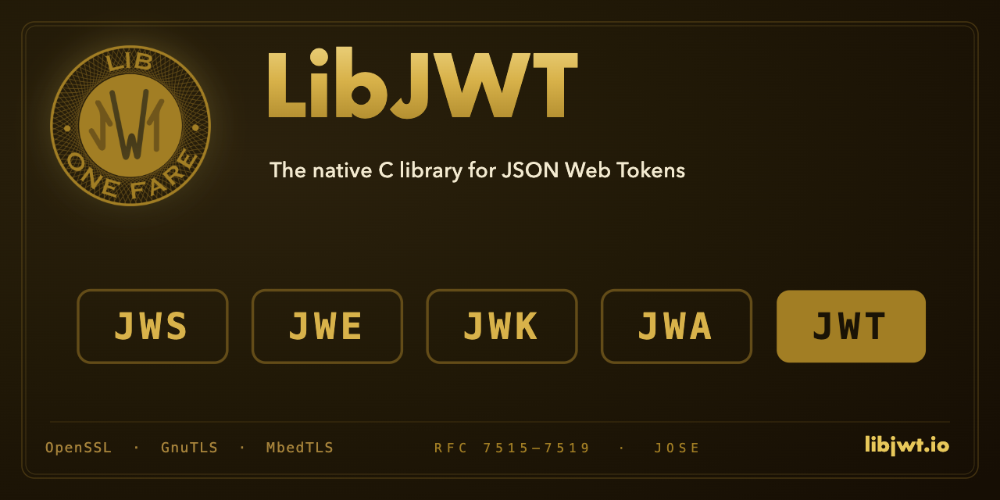

---

[](https://codecov.io/gh/benmcollins/libjwt)

[](https://maclara-llc.com)

## :bulb: Supported Standards

Standard | RFC                                                                        | Description
-------- | :------------------------------------------------------------------------: | ----------------------
``JWS``  | :page_facing_up: [RFC-7515](https://datatracker.ietf.org/doc/html/rfc7515) | JSON Web Signature
``JWE``  | :page_facing_up: [RFC-7516](https://datatracker.ietf.org/doc/html/rfc7516) | JSON Web Encryption
``JWK``  | :page_facing_up: [RFC-7517](https://datatracker.ietf.org/doc/html/rfc7517) | JSON Web Keys and Sets
``JWA``  | :page_facing_up: [RFC-7518](https://datatracker.ietf.org/doc/html/rfc7518) | JSON Web Algorithms
``JWT``  | :page_facing_up: [RFC-7519](https://datatracker.ietf.org/doc/html/rfc7519) | JSON Web Token
``JWK Thumbprint`` | :page_facing_up: [RFC-7638](https://datatracker.ietf.org/doc/html/rfc7638) / [RFC-9278](https://datatracker.ietf.org/doc/html/rfc9278) | JWK Thumbprint and Thumbprint URI
``cnf``  | :page_facing_up: [RFC-7800](https://datatracker.ietf.org/doc/html/rfc7800) | Proof-of-Possession (confirmation) claim helpers
``Unencoded Payload`` | :page_facing_up: [RFC-7797](https://datatracker.ietf.org/doc/html/rfc7797) | JWS unencoded (``b64=false``) and detached payloads
``BCP 225`` | :page_facing_up: [RFC-8725](https://datatracker.ietf.org/doc/html/rfc8725) | JWT Best Current Practices (``typ`` check, algorithm allowlist)

> [!NOTE]
> Throughout this documentation you will see links such as the ones
> above to RFC documents. These are relevant to that particular part of the
> library and are helpful to understand some of the specific standards that
> shaped the development of LibJWT.

## :construction: Build Prerequisites

### Required

- A JSON library: either [Jansson](https://github.com/akheron/jansson)
  (>= 2.0, the default) or [json-c](https://github.com/json-c/json-c)
  (>= 0.16, selected with ``-DWITH_JSON_C=ON``). The two are interchangeable.
- [CMake](https://cmake.org) (>= 3.7)

### Crypto support

- OpenSSL (>= 3.0.0)
- GnuTLS (>= 3.8.8)
- MbedTLS (>= 3.6.0)

> [!NOTE]
> At least one crypto backend is required, but any non-empty combination
> works. OpenSSL is enabled by default and can be disabled with
> ``-DWITH_OPENSSL=OFF``. Each backend parses and converts JWK(S) natively.

### Algorithm support matrix

JWS Algorithm ``alg``         | OpenSSL            | GnuTLS             | MbedTLS
:---------------------------- | :----------------- | :----------------- | :----------------------
``HS256`` ``HS384`` ``HS512`` | :white_check_mark: | :white_check_mark: | :white_check_mark:
``ES256`` ``ES384`` ``ES512`` | :white_check_mark: | :white_check_mark: | :white_check_mark:
``RS256`` ``RS384`` ``RS512`` | :white_check_mark: | :white_check_mark: | :white_check_mark:
``EdDSA`` using ``ED25519`` [^okp3813] | :white_check_mark: | :white_check_mark: | :x:
``EdDSA`` using ``ED448`` [^okp3813] | :white_check_mark: | :white_check_mark: | :x:
``PS256`` ``PS384`` ``PS512`` | :white_check_mark: | :white_check_mark: | :white_check_mark:
``ES256K``                    | :white_check_mark: | :x:                | :white_check_mark:
``ML-DSA-44/65/87`` [^mldsa]  | :white_check_mark: | :white_check_mark: | :x:

[^mldsa]: ML-DSA (FIPS 204, registered for JOSE by
[RFC 9964](https://datatracker.ietf.org/doc/rfc9964/)) is **experimental** and
**off by default**. Build with ``-DWITH_ML_DSA=ON``; it is only enabled when a
backend with ML-DSA support is present: OpenSSL >= 3.5, or GnuTLS >= 3.8.10
built against a PQC provider (e.g. ``--with-leancrypto``). When built in, the
public header defines ``LIBJWT_HAVE_ML_DSA``. ML-DSA keys use the ``"AKP"`` key
type with a ``"pub"`` member and a ``"priv"`` member holding the 32-byte
FIPS-204 seed. MbedTLS has no ML-DSA and rejects ``AKP`` keys.

[^okp3813]: On the **GnuTLS** backend these specific cases need **GnuTLS >=
3.8.13**: (a) loading an OKP *private* JWK supplied without its public
coordinate ``x``, a "seed-only" ``Ed25519``/``Ed448`` key (older GnuTLS
crashes deriving the public key); and (b) ``ECDH-ES`` with the ``X25519`` and
``X448`` curves. Anything that carries ``x`` (including every public key and
every PEM/DER key) is unaffected, as are the OpenSSL and MbedTLS backends. The
version is checked at **runtime**, so upgrading the shared ``libgnutls`` to >=
3.8.13 lifts the restriction without rebuilding LibJWT.

#### JWS serialization

LibJWT produces and verifies JWS (RFC 7515) in the Compact Serialization (the
default) and the JSON Serialization — both the Flattened form and the General
form with one or more signatures.

| JWS serialization | Signatures | Supported |
| :---------------- | :--------- | :-------- |
| Compact (RFC 7515 §7.1)          | one         | :white_check_mark: |
| JSON Flattened (RFC 7515 §7.2.2) | one         | :white_check_mark: |
| JSON General (RFC 7515 §7.2.1)   | one or more | :white_check_mark: |

Select the form with `jwt_builder_set_format()`; add extra signers (each with
its own algorithm and per-signature protected/unprotected header) with
`jwt_builder_add_signature()`. The same payload is signed independently by each
signer, so signatures may use different algorithms (e.g. RS256 + ES256).

To verify a multi-signature token, supply a set of candidate keys (a JWKS) with
`jwt_checker_setkeyring()` and a policy: `JWT_VERIFY_POLICY_ANY` (the default —
accept if at least one signature verifies, e.g. multi-issuer or key rotation) or
`JWT_VERIFY_POLICY_ALL` (every signature must verify, e.g. co-signing). A
signature naming a `kid` is matched to that key; a keyless one is tried against
every compatible key, always under the usual algorithm/key-type binding.
`jwt_checker_verify()` auto-detects Compact vs JSON input.

##### Unencoded and detached payloads (RFC 7797)

For a generic JWS over an opaque (non-claims) payload — e.g. HTTP message
signatures or JAdES/eIDAS detached signatures — set the payload bytes with
`jwt_builder_setpayload()`. `jwt_builder_setb64(b, 0)` selects the
[RFC 7797](https://datatracker.ietf.org/doc/html/rfc7797) unencoded form
(`"b64":false`, with `"b64"` marked critical and the signature computed over the
raw payload), and `jwt_builder_set_detached()` omits the payload from the output.
A detached token is verified with `jwt_checker_verify_detached()`, supplying the
payload out-of-band. As mandated by RFC 7797 §6, the checker rejects a
`"b64":false` token unless `"b64"` appears in `"crit"`.

#### Key generation

`jwks_generate()` produces a fresh key as a JWK, ready to sign/verify with:

```c
jwk_set_t *set = jwks_create_generate(JWK_KEY_TYPE_EC, "P-256",
                                      JWT_ALG_ES256, JWK_KEY_GEN_KID);
const jwk_item_t *key = jwks_item_get(set, 0);
```

It covers EC (incl. `secp256k1`), RSA / RSA-PSS, OKP (Ed25519/Ed448/X25519/X448),
`oct`, and AKP (ML-DSA), bound to the active crypto backend. `JWK_KEY_GEN_KID`
stamps the RFC 7638 thumbprint as the `kid`. Each backend generates what it
supports (OpenSSL: all; GnuTLS: all but `secp256k1`/X-curves; MbedTLS: EC/RSA;
`oct` everywhere); an unsupported request returns a clean error rather than a
weak or partial key.

#### JWE

LibJWT supports JWE (RFC 7516) in both the Compact Serialization and the JSON
Serialization (the Flattened form and the General form with one or more
recipients). A JWE uses two algorithms: a key management algorithm (``alg``)
and a content encryption algorithm (``enc``).

| JWE serialization | Recipients | Supported |
| :---------------- | :--------- | :-------- |
| Compact (RFC 7516 §7.1)        | one  | :white_check_mark: |
| JSON Flattened (RFC 7516 §7.2.2) | one  | :white_check_mark: |
| JSON General (RFC 7516 §7.2.1)   | one or more | :white_check_mark: |

With the JSON serializations the plaintext is encrypted once with a single CEK;
each recipient wraps that CEK independently, so any recipient's key can decrypt
the token. They also carry an optional shared unprotected header, per-recipient
headers, and an application AAD member.

Legend: :white_check_mark: native implementation &nbsp;·&nbsp; :x: not supported

JWE key management ``alg``    | OpenSSL            | GnuTLS             | MbedTLS
:---------------------------- | :----------------- | :----------------- | :-----------------
``dir`` (Direct Encryption)   | :white_check_mark: | :white_check_mark: | :white_check_mark:
``A128KW`` ``A192KW`` ``A256KW`` | :white_check_mark: | :white_check_mark: | :white_check_mark:
``RSA-OAEP`` (SHA-1)          | :white_check_mark: | :x:                | :white_check_mark:
``RSA-OAEP-256``              | :white_check_mark: | :white_check_mark: | :white_check_mark:
``ECDH-ES`` (+ ``+A128KW``/``+A192KW``/``+A256KW``) [^okp3813] | :white_check_mark: | :white_check_mark: | :white_check_mark:

JWE content encryption ``enc`` | OpenSSL            | GnuTLS             | MbedTLS
:----------------------------- | :----------------- | :----------------- | :-----------------
``A128GCM`` ``A192GCM`` ``A256GCM`` | :white_check_mark: | :white_check_mark: | :white_check_mark:
``A128CBC-HS256`` ``A192CBC-HS384`` ``A256CBC-HS512`` | :white_check_mark: | :white_check_mark: | :white_check_mark:

> [!NOTE]
> ``ECDH-ES`` supports both Direct Key Agreement and the ``+A*KW`` key
> wrapping modes, on the EC curves P-256/384/521 and the OKP curves
> X25519/X448, with optional ``apu``/``apv`` PartyInfo. ``RSA1_5`` and
> ``zip`` (compression) are intentionally not supported. Each backend
> implements JWE natively. GnuTLS/Nettle cannot perform RSA-OAEP with SHA-1,
> so the GnuTLS backend does not support plain ``RSA-OAEP`` (``RSA-OAEP-256``
> is native).

### Optional

- [Check Library](https://github.com/libcheck/check/issues) (>= 0.9.10) for unit
  testing
- [Doxygen](https://www.doxygen.nl) (>= 1.13.0) for documentation

## :books: Docs and Source

:link: [Current Docs](https://libjwt.io)

:link: [Legacy Docs v2.1.1](https://libjwt.io/stable)

:link: [GitHub Repo](https://github.com/benmcollins/libjwt)

## :package: Pre-built Packages

LibJWT is available in most Linux distributions as well as through
[Homebrew](https://formulae.brew.sh/formula/libjwt#default)
for Linux, macOS, and Windows.

## :hammer: Build Instructions

### With CMake:

    $ mkdir build
    $ cd build
    $ cmake ..
    $ make
